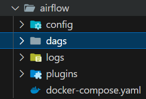

# Setup
After setting up the instance **VM**, we need to create two services that are used for the orchestration and processing for the ETL process, these services are the **Spark Cluster** and the **Airflow Orchestrator**.

To do this, bash scripts are already provided for the startup of these services.

It is recommended to copy the entire **ETL** folder into your machine for easier localization of scripts, however you can copy only the scripts as long as you are aware of the paths of execution.

## Spark Configuration
The script **create_cluster.sh** is in charge of create a cluster for Spark jobs orchestration and execution, this cluster contains a **master node** and a **worker node**, for Spark execution both are necessary.

In order to create this cluster, execute the script **create_cluster.sh**.

Remember to change permissions for **execution** to the script
```bash
chmod +x create_cluster.sh
```
And execute as:
```bash
./create_cluster.sh
```
As output, this will create a **.env** file that contains the link to the **spark master node**, in case is used for later tasks.

In case, you want to stop the cluster, simply execute the script **stop_cluster.py**, as always, remember to provide execution permissions for the script.
```bash
chmod +x stop_cluster.sh
./stop_cluster.sh
```

## Airflow Configuration
After configuring docker compose, copy the **airflow** folder into the VM.
Now, **switch to the directory where the docker-compose.yml and run_airflow.sh** files are, now, execute the script **run_airflow.sh**, remember to change permissions for **execution** to the script.
```bash
chmod +x run_airflow.sh
```
And execute as:
```bash
./run_airflow.sh
```
Now, airflow is up and running in a containerized way, to access airflow, remember to use the following credentials:
- USER = airflow
- PASSWORD = airflow

In case you want to stop the **airflow** containers, run the script **stop_airflow.sh**.
```bash
chmod +x stop_airflow.sh
./stop_airflow.sh
```

# DAGS
Once airflow was correctly configured, a folder called **dags** was created, as follows:



Make sure to direcly copy the content of the folder **ETL/dags** into that folder, since it provides the DAG as the orchestration for the ETL pipeline.

Make sure to create a **.env** file that contains the following elements:
- MASTER: Link to master node of spark
- GOOGLE_APPLICATION_CREDENTIALS: Absolute path to JSON credentials file
- PROJECT_ID: Project ID
- REGION: Region of GCP
- BUCKET_NAME: Provided name of the bucket
- INSTANCE_NAME: Name of the VM instance
- DATASET_NAME: Provided dataset for BigQuery without version
- BQ_DATASET_NAME: Provided dataset for BigQuery with version
- DATASET_VERSION: Dataset version
- GCP_CONNECTOR_LOCATION: Absolute path to JAR file for GCP Cloud Storage Spark connection

Example of **.env** file
```text

MASTER=spark://this-is-an-instance-test-stb.us-central1-a.c.dez-2024-project.internal:7077
GOOGLE_APPLICATION_CREDENTIALS=/home/sera/gcp_key.json
PROJECT_ID=dez-2024-project-stb
REGION=us-central1
BUCKET_NAME=this-is-a-test-bucket-stb
INSTANCE_NAME=this-is-an-instance-test-stb
DATASET_NAME=my_dataset_test
BQ_DATASET_NAME=my_dataset_test_v1_0
DATASET_VERSION=v1.0
GCP_CONNECTOR_LOCATION=/home/sera/etl_variables/gcs-connector-hadoop3-2.2.5.jar

```

This file is used to execute the three steps of the entire pipeline.