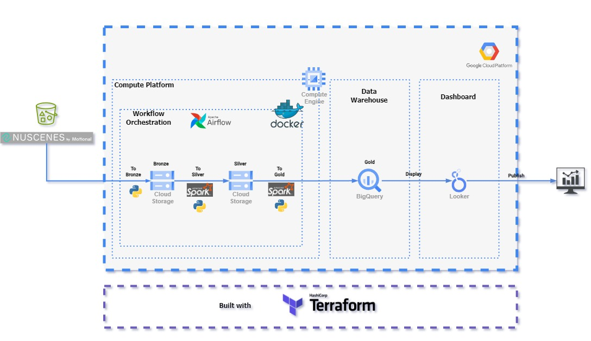

# Recreate project
In order to recreate project, please use the latest commit and refer to the following files in the suggested order
1. README.md (This file)
2. Infrastructure/README.md
3. ETL/README.md

# Nuscenes Project
Dataset from
https://www.nuscenes.org/nuscenes#overview

Please refer to each folder for code documentation

# Explanation

**NuScenes** is a public dataset for autonomous driving development, testing, research and benchmarking.

By releasing this dataset, the main goal of **NuScene** is to support public research into computer vision and autonomous driving, and encourage the generalization of the study of computer vision algorithm.

This dataset contains different traffic scenarios with two chosen cities, broadly known for their dense and diverse traffic: Boston and Singapore.

To faciliate the task of **object detection and classification**, this dataset also provides 23 classes of objects accurately annotated with multiple properties.

**Object detection and classifcation** will be the main focus of this project.

Can checkout more about this dataset in its official site: https://www.nuscenes.org/nuscenes

# Problem to Solve

As Data Engineer, you are closely working with the analytics team from a highly specialized company in developing autonomous mobilities projects, which one of their campus and advanced prototypes are located in Singapore.

For this project, the vehicle is currently in the **FOT(Field Operational Test)** phase, aided by a in-cabin driver in order to double check and collect metrics of all the sensors and cameras attached to the vehicle.

**In the previous software release, the object detection functionality achieved a score below expectancy, after some rework the new software release is ready for FOT testing.** 

Due to previous results, **the next FOT should focus on stressing the object detection capabilities, so improvements and corrections for the new software release can be confirmed.** To do so, the analytics along with the testing team need **to** **plan the next FOT session.**

From the previous FOT gathered data, do the needed actions in order to answer the following questions that will help to plan the new testing sessions with the available data.

## Questions:

- What is the location(zone) where the most objects are detected?
- When is the time of the day where more objects are detecte?
- What is the class of object that is detected the most?
- Where is the place where more bicycles were detected?
- At what location visibility is the minimum?
- At what time visibility is minimum?
- Is there a zone where the major mismatches were achieved?

# Data Explanation

## **Zones:**

The following zones were selected for testing due to its challenging conditions in traffic.

- Boston - Seaport
- Singapore - One North
- Singapore - Queenstown
- Singapore - Holland Village

## **Scenes and Frames:**

**Log:** a log is a long video file that contains a collection of sensors and cameras recorded data during a single driving session.

**Scenes:** Are a collection of frames of 20 seconds video length, they represent a diverse and interesting set of driving and traffic conditions with **many objects in sight**.

**Key frames:** Are frames that coincide with a LIDAR and RADAR entire sweep, meaning that this frame coincides with the measurement cycle of LIDAR and RADAR at the same time, making it an **extremely accurate frame** for objects and conditions identification.

## Annotations

https://github.com/nutonomy/nuscenes-devkit/blob/master/docs/instructions_nuscenes.md

Annotations are labels that represent objects or events in a scene, these annotations include detailed and relevant information that can be use as reference points for developing perception in computer vision systems.

### Categories:

- animal
- human.pedestrian.adult
- human.pedestrian.child
- human.pedestrian.construction_worker
- human.pedestrian.personal_mobility
- human.pedestrian.police_officer
- human.pedestrian.stroller
- human.pedestrian.wheelchair
- static_object.bicycle_rack
- vehicle.bicycle
- vehicle.bus.bendy
- vehicle.bus.rigid
- vehicle.car
- vehicle.construction
- vehicle.emergency.ambulance
- vehicle.emergency.police
- vehicle.motorcycle
- vehicle.trailer
- vehicle.truck
- vehicle.ego
- noise

For these categories, some can have the following attributes:

- vehicle.moving
- cycle.with_rider
- pedestrian.moving

## **Current Data Schema:**

Currently stored in AWS S3 bucket, part of **Registry Open Data on AWS**, measurements and tables are stored as JSON files.

The data was stored in a relational database with an **OLTP** engine, schema is as follows:

# Pipelines
## Data Pipeline into Data Lake
Stored unsing **medallion architecture** as:

### Bronze

Data is currently stored in **AWS S3 Bucket** as part of the **Registry of Open Data on AWS** as: https://registry.opendata.aws/motional-nuscenes/

Where the direction of the bucket is https://d36yt3mvayqw5m.cloudfront.net/

This phase consists the extraction of the raw data into the desired location, without any transformation, data is loade as it is.

Most of the files refer to **images** and **clouds of points** from the radars. For our current scope, we only need the **metadata**

**Metadata** is stored in two main folders:

- **test meta:** https://d36yt3mvayqw5m.cloudfront.net/public/v1.0/v1.0-test_meta.tgz
- **training and evaluation meta:** https://d36yt3mvayqw5m.cloudfront.net/public/v1.0/v1.0-trainval_meta.tgz

Required data is stored in a **cloud storage** bucket as:

### Silver
In this phase, data is transformed from raw format into a standardized format, specific columns and tables from the dataset are filtered and cleaned out, and, columns are transformed into correct data types.

For this case, the selected tables and colums of the dataset are:
- Category:
    - token: string
    - category: string
    - description: string
    - object: string
- Visibility:
    - token: integer
    - description: string
    - level_low: integer
    - level_high: integer
- Instance:
    - token: string
    - category_token: string
    - nbr_annotations: integer
    - first_annotation_token: string
    - last_annotation_token: string
- Log
    - token: string
    - logfile: string
    - vehicle: string
    - date_captured: date
    - location: string
- Sample
    - token: string
    - timestamp: timestamp
    - prev: string
    - next: string
    - scene_token: string
- Sample_annotation
    - token: string
    - sample_token: string
    - instance_token: string
    - visibility_token: decimal
    - attribute_tokens: string
    - translation: string
    - size: string
    - rotation: string
    - prev: string
    - next: string
    - num_lidar_pts: integer
    - num_radar_pts: integer
- Sample_data
    - token: string
    - sample_token: string
    - ego_pose_token: string
    - calibrated_sensor_token: string
    - timestamp: timestamp
    - fileformat: string
    - is_key_frame: boolean
    - height: integer
    - width: integer
    - filename: string
    - prev: string
    - next: string
- Scene
    - token: string
    - log_token: string
    - nbr_samples:string
    - first_sample_token: string
    - last_sample_token: string
    - name: string
    - description: string

After correction of data types, these are stored in a **bucket** in **Cloud Storage** as parquet files for later usage.

### Gold
This is the point where data is completely available to be used by analysts.
Tables from silver are converted into two major tables called:
- Objects: Contain data related to categories and instances of objects, indicate which object appeared in a sample and under what circumstances
- Samples: Contain data related to the sample frame, like location, name and timestamp of capture.
Tables are stored into a **BigQuery** dataset and ready for usage for analytics or dashboarding.

## Data Pipeline into Data Warehouse

## Data Lineage
This section explains how data was transformed from its original source into the final storage in the cloud.

**Seeds:** Data that does not change, can be used as reference

- Category
- Visibility
- *Attribute*
- *Map*

**Sources:** Data that contains a wide variety of information and can change with each run

- Log
- Scene
- Instance
- Sample
- Sample Annotation
- Sample Data
- *Ego Pose*

Can follow transformation as:

# Infrastructure

Using **Google Cloud Platform**, infrastructure provided for this project is organized as follows:

Main services used:
- Compute Engine
- Cloud Storage
- BigQuery
- Looker Studio

IaC code and execution instructions can be found in the **Infrastructure** folder

# Orchestration

# Dashboard